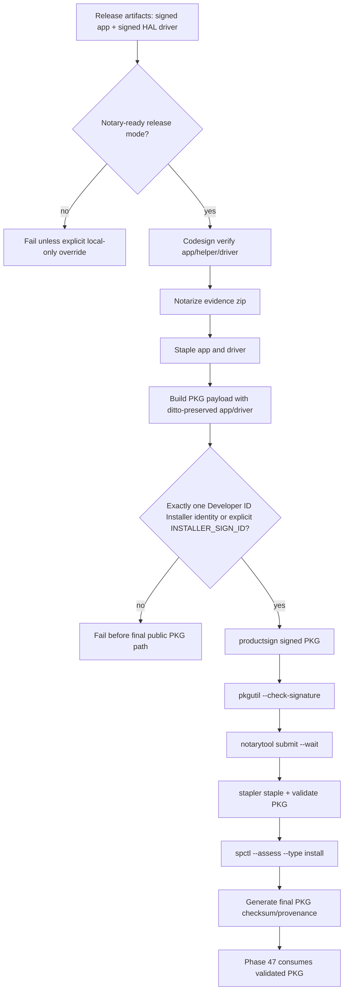

# Phase 46: PKG Installer Promotion - Research

**Researched:** 2026-07-01 [VERIFIED: system date]
**Domain:** macOS Developer ID Installer package promotion, notarization, release automation [VERIFIED: .planning/ROADMAP.md]
**Confidence:** HIGH [VERIFIED: local code inspection + Apple docs + live toolchain probes]

<user_constraints>
## User Constraints (from CONTEXT.md)

### Locked Decisions

### Public Package Contract
- The signed `.pkg` becomes a required public release artifact for this
  milestone, not an optional `APM44_BUILD_PKG=1` side path.
- Release mode must fail before publication when the Developer ID Installer
  identity is missing, ambiguous, or does not actually sign the package.
- Local-only or maintainer-experiment package output may exist only behind an
  explicit local-development override and must be labeled as not publishable.
- Package validation must include `pkgutil --check-signature`, `spctl --assess
  --type install`, notarization acceptance, stapling, and stapler validation.

### Payload and Upgrade Behavior
- The package payload must be built from the final signed/stapled app and HAL
  driver artifacts, preserving extended attributes rather than rebuilding loose
  or unstapled copies.
- The package installs `APM44 Bridge.app` to `/Applications` and
  `APM44Bridge.driver` to `/Library/Audio/Plug-Ins/HAL` with root-owned HAL
  permissions.
- Upgrade behavior must replace stale app/helper/driver state from the current
  latest public release rather than leaving parallel or ambiguous installed
  files.
- Postinstall may reload Core Audio and open the app best-effort, but release
  proof must not depend on best-effort UI launch succeeding.

### Release Gate Composition
- `scripts/release-all.sh` should orchestrate the package gate in the normal
  notarized release path so Phase 47 can wrap the validated package into the
  final DMG.
- Package checksum and provenance should be generated only after package
  stapling, matching the final bytes later published or wrapped.
- Tests should use fake `security`, `productsign`, `pkgutil`, `spctl`, and
  `xcrun stapler/notarytool` behavior where possible so fail-closed release
  order is CI-testable without Apple credentials.
- The release scripts should keep the existing explicit local-only
  unnotarized override, but public package claims require real notary/profile
  readiness and installer signing.

### Certificate and Operator Setup
- If no usable Developer ID Installer identity exists on this machine, the
  phase must record a blocker or setup path; it must not silently downgrade the
  public release contract.
- Existing CSR/import helper scripts may be reused, but certificate/private-key
  material and local signing artifacts must remain untracked and ignored.
- Error messages should tell the maintainer exactly which identity/profile is
  missing and which setup script or Apple Developer step to run.
- Operator-owned target-hardware soak remains out of scope for Phase 46; this
  phase proves package construction and package-level install readiness.

### the agent's Discretion
The agent may choose the smallest structural script/test changes that make the
package path fail closed and composable with later DMG/install/publication
phases. Prefer extending existing scripts over adding a parallel packaging
framework unless the current script shape blocks signed/notarized package
promotion.

### Deferred Ideas (OUT OF SCOPE)
- Phase 47 owns replacing the raw DMG folder view with a PKG-first professional
  mounted layout.
- Phase 48 owns installing from the final mounted DMG/PKG path and proving
  installed app/helper/HAL sync on the live system.
- Phase 49 owns public documentation and full release-hygiene text updates.
- Phase 50 owns GitHub latest release publication and downloaded-asset proof.
</user_constraints>

<phase_requirements>
## Phase Requirements

| ID | Description | Research Support |
|----|-------------|------------------|
| PKG-01 | User can install or upgrade APM44 Bridge through a Developer ID Installer-signed `.pkg` that installs the menu bar app and HAL driver to their intended system locations. [VERIFIED: .planning/REQUIREMENTS.md] | Use `pkgbuild --root` with destination-root payload under `Applications/` and `Library/Audio/Plug-Ins/HAL/`; current payload probe listed both target paths. [VERIFIED: scripts/build-release-pkg.sh + pkgutil --payload-files] |
| PKG-02 | Maintainer release mode fails before publication if a valid Developer ID Installer identity is unavailable or the package is unsigned. [VERIFIED: .planning/REQUIREMENTS.md] | Current script warns and moves unsigned package to final path on missing identity, so planning must add a public-mode hard failure and ambiguity failure. [VERIFIED: scripts/build-release-pkg.sh:90-98] |
| PKG-03 | Maintainer can notarize, staple, validate, and Gatekeeper assess the final `.pkg` before it is wrapped or published. [VERIFIED: .planning/REQUIREMENTS.md] | `notarize-release-pkg.sh` already calls shared notary acceptance and stapler, but it does not run `pkgutil --check-signature`, `spctl --assess --type install`, or checksum generation. [VERIFIED: scripts/notarize-release-pkg.sh:34-39] |
| PKG-04 | The package install path preserves signed/stapled app and driver payload integrity and records a deterministic app/helper/driver build identity. [VERIFIED: .planning/REQUIREMENTS.md] | Existing build ID is `PROJECT_VERSION + git short SHA` and app/helper sync verification already parses repo/helper IDs. [VERIFIED: CMakeLists.txt:15-40 + scripts/verify-installed-sync.sh:104-131] |
| PKG-05 | The package handles first install and upgrade over an existing APM44 Bridge install without leaving stale app, helper, or HAL driver files. [VERIFIED: .planning/REQUIREMENTS.md] | Current postinstall changes driver ownership and reloads Core Audio, but it does not explicitly remove stale app/driver before install or verify installed sync after `installer -pkg`. [VERIFIED: scripts/build-release-pkg.sh:63-79] |
</phase_requirements>

## Summary

Phase 46 should promote the existing shell-script PKG path, not replace it with a new packaging system. [VERIFIED: CONTEXT.md + scripts/build-release-pkg.sh] The current package script already stages `APM44 Bridge.app` and `APM44Bridge.driver`, uses `pkgbuild`, resolves a Developer ID Installer identity, and signs with `productsign` when possible. [VERIFIED: scripts/build-release-pkg.sh:44-98] The public-release gap is that missing identity still produces a final `.pkg` path with only a warning, while public mode must fail closed. [VERIFIED: scripts/build-release-pkg.sh:90-98]

The local release Mac is capable of doing this phase: a Developer ID Installer identity is available, a Developer ID Application identity is available, and `xcrun notarytool history --keychain-profile AC_NOTARY` succeeds. Exact certificate subject strings are intentionally redacted from tracked planning artifacts. [VERIFIED: security find-identity + xcrun notarytool history] A research probe built `build/signing/APM44Bridge-0.11.1.pkg`; `pkgutil --check-signature` reported a trusted Apple-issued Developer ID Installer signature, and `spctl --assess --type install` rejected it as `Unnotarized Developer ID` before package notarization. [VERIFIED: local package probe 2026-07-01]

**Primary recommendation:** Make `scripts/release-all.sh` build, notarize, staple, validate, assess, checksum, and list the signed PKG in the normal notary-ready path; keep unnotarized/unsigned PKG output only behind a clearly local-only override. [VERIFIED: CONTEXT.md + scripts/release-all.sh:55-62]

## Architectural Responsibility Map

| Capability | Primary Tier | Secondary Tier | Rationale |
|------------|-------------|----------------|-----------|
| Package construction | Release Automation | Filesystem / Installer | `build-release-pkg.sh` owns staging, package metadata, scripts, and signing; macOS Installer consumes the resulting payload. [VERIFIED: scripts/build-release-pkg.sh] |
| Developer ID Installer identity enforcement | Release Automation | Keychain | Shell scripts query `security find-identity`; the keychain stores the certificate/private key. [VERIFIED: scripts/build-release-pkg.sh:29-42 + security find-identity] |
| Notarization and stapling | Release Automation | Apple Notary Service | `notarize-release-pkg.sh` calls the shared notary helper and `xcrun stapler`; Apple documents `notarytool` and `stapler` for custom workflows. [VERIFIED: scripts/notarize-release-pkg.sh + CITED: https://developer.apple.com/developer-id/] |
| Package install / upgrade | macOS Installer | Release Validation | `installer -pkg ... -target /` applies the package to the root volume; validation scripts prove installed app/helper/HAL state. [VERIFIED: man installer(8) + scripts/verify-installed-sync.sh + scripts/verify-hal-driver.sh] |
| Build identity proof | Build System | Release Validation | CMake defines `APM44_BUILD_ID` from project version and git SHA, and validation compares repo/helper/live IDs. [VERIFIED: CMakeLists.txt:15-40 + scripts/verify-installed-sync.sh:104-131] |

## Standard Stack

### Core

| Tool / Script | Version | Purpose | Why Standard |
|---------------|---------|---------|--------------|
| `pkgbuild` | Apple tool in `/usr/bin/pkgbuild` [VERIFIED: command -v] | Builds the flat package from a destination root and package scripts. [VERIFIED: man pkgbuild(1)] | Apple first-party tool supports `--root`, `--scripts`, `--identifier`, `--version`, and ownership controls. [VERIFIED: man pkgbuild(1)] |
| `productsign` | Apple tool in `/usr/bin/productsign` [VERIFIED: command -v] | Signs the installer package with the Developer ID Installer identity. [VERIFIED: man productsign(1)] | Apple Xcode Help says Mac Installer Packages distributed with Developer ID must use a Developer ID Installer certificate and warns that Developer ID Application can appear to work but fail on destination Macs. [CITED: https://help.apple.com/xcode/mac/current/en.lproj/deve51ce7c3d.html] |
| `xcrun notarytool` | Xcode 26.6 available [VERIFIED: xcodebuild -version + xcrun notarytool --help] | Submits the signed package to Apple notarization with `--wait`. [VERIFIED: xcrun notarytool help submit] | Apple Developer ID docs name `xcrun notarytool` for custom uploads and say ZIP, PKG, and DMG uploads are supported. [CITED: https://developer.apple.com/developer-id/] |
| `xcrun stapler` | Xcode 26.6 available [VERIFIED: xcodebuild -version + xcrun stapler] | Staples and validates the package ticket. [VERIFIED: xcrun stapler usage] | `stapler` supports signed flat installer packages. [VERIFIED: xcrun stapler usage] |
| `pkgutil --check-signature` | Apple tool in `/usr/sbin/pkgutil` [VERIFIED: command -v] | Validates package signature and prints certificate chain. [VERIFIED: pkgutil --help] | Current package probe confirmed it identifies the Developer ID Installer chain. [VERIFIED: local package probe] |
| `spctl --assess --type install` | Apple tool in `/usr/sbin/spctl` [VERIFIED: command -v] | Gatekeeper assessment for installer packages. [VERIFIED: spctl usage] | Apple Xcode Help recommends `spctl -a -v --type install` to test the installer package. [CITED: https://help.apple.com/xcode/mac/current/en.lproj/deve51ce7c3d.html] |

### Supporting

| Tool / Script | Version | Purpose | When to Use |
|---------------|---------|---------|-------------|
| `ditto` | Apple tool in `/usr/bin/ditto` [VERIFIED: command -v] | Copies app and driver bundles into staging while preserving resource forks, extended attributes, ACLs, and quarantine by default. [VERIFIED: man ditto(1)] | Use for staging signed/stapled bundles; avoid `cp -R` for release payloads. [VERIFIED: man ditto(1)] |
| `security` | Apple tool in `/usr/bin/security` [VERIFIED: command -v] | Finds Developer ID Application/Installer identities and imports certificate material. [VERIFIED: scripts/build-release-pkg.sh + scripts/install-installer-cert.sh] | Use for identity resolution and fail-closed setup diagnostics. [VERIFIED: scripts/build-release-pkg.sh:29-42] |
| `installer` | Apple tool in `/usr/sbin/installer` [VERIFIED: command -v] | Installs a package with `-pkg` and `-target`. [VERIFIED: man installer(8)] | Use in Phase 46 only for controlled package install smoke/upgrade proof, with deeper final-artifact install proof deferred to Phase 48. [VERIFIED: CONTEXT.md deferred scope] |
| `tests/test_release_scripts.sh` | Bash test harness [VERIFIED: file inspection] | Credential-free release-script regression tests with fake Apple tooling. [VERIFIED: tests/test_release_scripts.sh:17-166] | Extend for identity ambiguity, unsigned-package blocking, package validation order, and post-staple checksum. [VERIFIED: tests/test_release_scripts.sh] |

### Alternatives Considered

| Instead of | Could Use | Tradeoff |
|------------|-----------|----------|
| `pkgbuild` + `productsign` | `productbuild --component` or distribution XML | Product archives support richer UI/requirements, but Phase 46 is locked to the smallest promotion of the existing package path; custom UI is explicitly future scope. [VERIFIED: CONTEXT.md + man productbuild(1)] |
| Shell scripts | Third-party packaging framework | Adds dependency and new trust surface; current scripts already cover build, signing, notary, and test fakes. [VERIFIED: CONTEXT.md + scripts/release-all.sh + tests/test_release_scripts.sh] |

**Installation:** No new package dependency is required for Phase 46. [VERIFIED: local tool availability audit]

**Version verification:** `sw_vers` reported macOS 26.5; `xcodebuild -version` reported Xcode 26.6; `cmake --version` reported 4.3.3; `xcodegen --version` reported 2.45.4; `openssl version` reported 3.6.2; `git --version` reported 2.53.0. [VERIFIED: local environment probe]

## Architecture Patterns

### System Architecture Diagram



All nodes in this diagram map to existing scripts except the hard failure on ambiguous/missing installer identity, the package signature/Gatekeeper checks, and post-staple package checksum/provenance. [VERIFIED: scripts/build-release-pkg.sh + scripts/notarize-release-pkg.sh + scripts/release-all.sh]

### Recommended Project Structure

```text
scripts/
├── build-release-pkg.sh          # package staging, pkgbuild, Developer ID Installer resolution/signing
├── notarize-release-pkg.sh       # notary acceptance, stapling, package signature/Gatekeeper/checksum gate
├── release-all.sh                # normal release orchestration, now always includes public PKG gate
├── install-installer-cert.sh     # reusable certificate import/setup helper
└── create-installer-csr.sh       # reusable CSR/private-key generation helper
tests/
└── test_release_scripts.sh       # fake security/productsign/pkgutil/spctl/xcrun coverage
docs/
├── release.md                    # maintainer sequence must stop calling PKG maintainer-only for Phase 46 gate
└── release-validation.md         # release-Mac package validation commands and blocker messages
```

The structure above extends existing ownership boundaries and avoids adding a parallel package framework. [VERIFIED: CONTEXT.md + local file inspection]

### Pattern 1: Public Release Mode Fails Before Final Package Output

**What:** Resolve `INSTALLER_SIGN_ID`; if unset, collect Developer ID Installer identities, require exactly one, and fail if zero or multiple. [VERIFIED: scripts/build-release-pkg.sh current resolver + CONTEXT.md]

**When to use:** Use in normal `release-all.sh` notary-ready mode and in `build-release-pkg.sh` unless an explicit local-only override is set. [VERIFIED: CONTEXT.md]

**Example:**

```bash
# Source: current script pattern plus Phase 46 locked decision.
identities="$(security find-identity -v -p basic 2>/dev/null | sed -n 's/.*"\(Developer ID Installer: .*\)".*/\1/p' | sed '/^$/d')"
count="$(printf '%s\n' "$identities" | wc -l | tr -d ' ')"
if [[ -n "${INSTALLER_SIGN_ID:-}" ]]; then
  identity="$INSTALLER_SIGN_ID"
elif [[ "$count" == "1" ]]; then
  identity="$identities"
else
  echo "error: expected exactly one Developer ID Installer identity; set INSTALLER_SIGN_ID or run scripts/install-installer-cert.sh" >&2
  exit 1
fi
```

This example preserves the current auto-detect pattern while making ambiguous identity state a release blocker. [VERIFIED: scripts/build-release-pkg.sh:29-42 + CONTEXT.md]

### Pattern 2: Validate Package After Final Stapling

**What:** Run `pkgutil --check-signature`, `xcrun stapler validate`, and `spctl --assess --type install` after notarization and stapling. [VERIFIED: ROADMAP verification gates + xcrun stapler usage + pkgutil --help + spctl usage]

**When to use:** Use after `require_notary_accepted` and `xcrun stapler staple "$PKG"`, before checksum/provenance and before Phase 47 wraps the PKG. [VERIFIED: scripts/notarize-release-pkg.sh current order]

**Example:**

```bash
# Source: Apple Xcode Help and existing DMG checksum pattern.
require_notary_accepted "$PKG" "$PROFILE" "pkg"
xcrun stapler staple "$PKG"
xcrun stapler validate "$PKG"
pkgutil --check-signature "$PKG"
spctl --assess --type install --verbose=4 "$PKG"
(cd "$(dirname "$PKG")" && shasum -a 256 "$(basename "$PKG")" >"$(basename "$PKG").sha256")
```

The checksum must be generated after stapling so it matches final package bytes. [VERIFIED: CONTEXT.md + scripts/notarize-release-dmg.sh checksum pattern]

### Anti-Patterns to Avoid

- **Unsigned final package path:** Do not move an unsigned package to `build/signing/APM44Bridge-<version>.pkg` in public mode; that currently masks PKG-02 failure. [VERIFIED: scripts/build-release-pkg.sh:90-98]
- **Developer ID Application for installer signing:** Do not accept an Application identity for `productsign`; Apple warns it can appear to work but fail on destination Macs. [CITED: https://help.apple.com/xcode/mac/current/en.lproj/deve51ce7c3d.html]
- **Checksum before stapling:** Do not generate `.pkg.sha256` before notarization stapling mutates the package bytes. [VERIFIED: CONTEXT.md + existing DMG checksum policy]
- **UI launch as proof:** Do not treat postinstall `open` success as release proof; context says UI launch is best-effort and proof must be scripted. [VERIFIED: CONTEXT.md]
- **`cp -R` release payload staging:** Do not use `cp -R` for signed/stapled bundles; `ditto` preserves resource forks and extended attributes by default. [VERIFIED: man ditto(1)]

## Don't Hand-Roll

| Problem | Don't Build | Use Instead | Why |
|---------|-------------|-------------|-----|
| Package format | Custom archive or shell-only installer | `pkgbuild` flat package | macOS Installer consumes signed flat packages and `pkgbuild` handles BOM/payload/package scripts. [VERIFIED: man pkgbuild(1)] |
| Installer package signature | Custom codesign checks only | `productsign` + `pkgutil --check-signature` | `productsign` signs installer archives; `pkgutil` validates package signature/cert chain. [VERIFIED: man productsign(1) + pkgutil --help] |
| Notarization parsing | Ad hoc `grep Accepted` in each script | `require_notary_accepted` | Shared helper already fails on nonzero submit and non-accepted status. [VERIFIED: scripts/notary-result.sh] |
| Gatekeeper package acceptance | Manual Finder double-click | `spctl --assess --type install` | Apple Xcode Help recommends `spctl` package assessment. [CITED: https://help.apple.com/xcode/mac/current/en.lproj/deve51ce7c3d.html] |
| Installed build identity proof | Manual visual inspection | `verify-installed-sync.sh`, `verify-hal-driver.sh`, `apm44-bridge --shm-status` | Existing scripts compare repo/helper/HAL build identity and Gatekeeper state. [VERIFIED: scripts/verify-installed-sync.sh + scripts/verify-hal-driver.sh] |

**Key insight:** The hard part is not creating a `.pkg`; the hard part is preventing a locally useful but unsigned/unnotarized package from becoming a public artifact claim. [VERIFIED: local package probe + CONTEXT.md]

## Runtime State Inventory

| Category | Items Found | Action Required |
|----------|-------------|------------------|
| Stored data | No package receipt currently exists for APM44 Bridge; `pkgutil --pkgs | rg -i 'apm44|niko'` returned no package IDs. [VERIFIED: pkgutil local probe] | First public PKG install creates a new receipt; planner should add receipt-aware upgrade validation but no receipt migration is needed from prior DMG installs. [VERIFIED: pkgutil local probe + PKG-05] |
| Live service config | Current latest public release is `v0.11.1` on GitHub, published 2026-07-01, and there are no repo-discovered external service configs needed for package install. [VERIFIED: gh release list + repo grep] | Upgrade test should install over the `v0.11.1` app/driver state, not an arbitrary old local build. [VERIFIED: ROADMAP + gh release list] |
| OS-registered state | Installed app exists at `/Applications/APM44 Bridge.app`; installed driver exists at `/Library/Audio/Plug-Ins/HAL/APM44Bridge.driver`; running processes include the menu bar app, embedded helper, and Core Audio driver. [VERIFIED: local `ls` + `ps` probe] | Package postinstall/preinstall should replace these paths cleanly and reload Core Audio best-effort; validation should not depend on app launch success. [VERIFIED: CONTEXT.md + local probe] |
| Secrets/env vars | No tracked secret-shaped files matched `.env`, `.p8`, `.p12`, `.pem`, `.key`, cert-request, or notary-log patterns; local Developer ID identities and notary profile exist in Keychain. [VERIFIED: git ls-files scan + security/notary probes] | Keep certificate/private-key artifacts ignored; errors should point to `create-installer-csr.sh`, `install-installer-cert.sh`, and `setup-notary-profile.sh`. [VERIFIED: scripts/create-installer-csr.sh + scripts/install-installer-cert.sh + CONTEXT.md] |
| Build artifacts | Research generated `build/signing/APM44Bridge-0.11.1.pkg`; existing signing outputs include DMGs, zips, staging roots, and generated package staging. [VERIFIED: find build/signing + package probe] | Planner should include cleanup/regeneration steps or tolerate stale local build artifacts; public proof must come from a clean release sequence. [VERIFIED: docs/release-validation.md + STATE.md] |

## Common Pitfalls

### Pitfall 1: Signing With The Wrong Certificate Class
**What goes wrong:** A package can be signed with a Developer ID Application identity, but Apple warns that this apparent success can fail on destination Macs. [CITED: https://help.apple.com/xcode/mac/current/en.lproj/deve51ce7c3d.html]
**Why it happens:** `productsign` accepts a signing identity name, so scripts must filter for `Developer ID Installer:` rather than any Developer ID identity. [VERIFIED: man productsign(1) + scripts/build-release-pkg.sh]
**How to avoid:** Enforce `Developer ID Installer:` prefix, exact match in `security find-identity`, and `pkgutil --check-signature` output containing Developer ID Installer. [VERIFIED: local package probe]
**Warning signs:** `pkgutil --check-signature` lacks `Developer ID Installer`, or script accepts `Developer ID Application`. [VERIFIED: local package probe + Apple Xcode Help]

### Pitfall 2: Ambiguous Identity Auto-Selection
**What goes wrong:** Multiple installer identities can cause nondeterministic signing or use of an unintended team. [VERIFIED: CONTEXT.md]
**Why it happens:** Current resolver only emits an identity when count is one, but current script falls through to unsigned output if resolution fails. [VERIFIED: scripts/build-release-pkg.sh:29-42 + 90-98]
**How to avoid:** Zero or multiple identities must exit with instructions to set `INSTALLER_SIGN_ID`. [VERIFIED: CONTEXT.md]
**Warning signs:** `security find-identity -v -p basic` lists more than one `Developer ID Installer:` line. [VERIFIED: security local probe]

### Pitfall 3: Valid Signature But Missing Notary Ticket
**What goes wrong:** A signed package can still be rejected by Gatekeeper as unnotarized. [VERIFIED: local package probe]
**Why it happens:** `productsign` proves package signature, not Apple notarization acceptance/stapling. [VERIFIED: local package probe + Apple Developer ID docs]
**How to avoid:** Treat `require_notary_accepted`, `xcrun stapler validate`, and `spctl --assess --type install` as required gates. [VERIFIED: ROADMAP verification gates + scripts/notarize-release-pkg.sh]
**Warning signs:** `spctl` prints `source=Unnotarized Developer ID`. [VERIFIED: local package probe]

### Pitfall 4: Upgrade Leaves Stale State
**What goes wrong:** Old app/helper/driver files remain after an upgrade and create mismatched build IDs or ambiguous installed state. [VERIFIED: PKG-05 + scripts/verify-installed-sync.sh]
**Why it happens:** Existing package postinstall sets ownership and reloads Core Audio but does not explicitly remove stale app/driver before payload install. [VERIFIED: scripts/build-release-pkg.sh:63-79]
**How to avoid:** Add preinstall/postinstall replacement semantics and test upgrade over current latest public release state; verify with `verify-installed-sync.sh` and `verify-hal-driver.sh`. [VERIFIED: CONTEXT.md + scripts/verify-installed-sync.sh + scripts/verify-hal-driver.sh]
**Warning signs:** Installed helper build ID differs from repo build ID, or installed HAL executable hash differs from build. [VERIFIED: scripts/verify-installed-sync.sh:128-131 + scripts/verify-hal-driver.sh:75-83]

## Code Examples

### Package Gate In Release Orchestration

```bash
# Source: scripts/release-all.sh current ordering + Phase 46 locked release composition.
echo "== Build pkg from stapled artifacts =="
bash scripts/build-release-pkg.sh
echo "== Notarize and validate pkg =="
bash scripts/notarize-release-pkg.sh
```

This must run in the normal notary-ready branch, not behind `APM44_BUILD_PKG=1`. [VERIFIED: CONTEXT.md + scripts/release-all.sh:55-62]

### Package Validation Commands

```bash
# Source: Apple Xcode Help + local verification gates.
pkgutil --check-signature "build/signing/APM44Bridge-${APM44_VERSION:-0.11.1}.pkg"
xcrun stapler validate "build/signing/APM44Bridge-${APM44_VERSION:-0.11.1}.pkg"
spctl --assess --type install --verbose=4 "build/signing/APM44Bridge-${APM44_VERSION:-0.11.1}.pkg"
```

These commands should be automated in scripts and mirrored by regression tests with fake `pkgutil`, `spctl`, and `xcrun`. [VERIFIED: CONTEXT.md + tests/test_release_scripts.sh]

### Upgrade Proof Command

```bash
# Source: installer(8), existing validation scripts, and PKG-05.
sudo installer -pkg "build/signing/APM44Bridge-${APM44_VERSION:-0.11.1}.pkg" -target /
APM44_APP_PATH="/Applications/APM44 Bridge.app" bash scripts/verify-installed-sync.sh
bash scripts/verify-hal-driver.sh
```

Full final-artifact install proof is Phase 48, but Phase 46 should provide package-level upgrade readiness or a clearly marked manual gate. [VERIFIED: CONTEXT.md deferred scope + scripts/verify-installed-sync.sh]

## State of the Art

| Old Approach | Current Approach | When Changed | Impact |
|--------------|------------------|--------------|--------|
| `altool` notarization | `notarytool` notarization | Apple stopped accepting `altool` / Xcode 13-or-earlier uploads on 2023-11-01. [CITED: https://developer.apple.com/developer-id/] | Phase 46 should continue using `xcrun notarytool`, not revive `altool`. [VERIFIED: scripts/notary-result.sh] |
| DMG-primary public distribution | PKG-primary installer promoted before polished DMG wrapper | Phase 46 in v1.2. [VERIFIED: ROADMAP.md] | `APM44_BUILD_PKG=1` becomes obsolete for public release mode. [VERIFIED: CONTEXT.md] |
| Optional package validation | Mandatory package validation | Phase 46 locked decision. [VERIFIED: CONTEXT.md] | `pkgutil`, `spctl`, stapling, notary acceptance, and checksum must be release gates. [VERIFIED: CONTEXT.md] |

**Deprecated/outdated:**
- `APM44_BUILD_PKG=1` as the public-package switch is outdated for Phase 46; keep it only as a local compatibility override if useful. [VERIFIED: CONTEXT.md]
- `docs/release.md` and `docs/install.md` currently call PKG maintainer-only; Phase 46 should at least update maintainer validation text, while Phase 49 owns full public docs. [VERIFIED: docs/release.md:31-33 + docs/install.md:16-19 + CONTEXT.md]

## Assumptions Log

| # | Claim | Section | Risk if Wrong |
|---|-------|---------|---------------|
| A1 | Research remains valid until 2026-07-08 for Apple signing/notary operational details, while repo-specific script findings remain valid until the scripts change. [ASSUMED] | Metadata | Planner may trust stale Apple operational behavior or changed local scripts too long. |

## Open Questions (RESOLVED)

1. **Should Phase 46 run a real `sudo installer -pkg` upgrade smoke, or only script it for Phase 48?** [VERIFIED: CONTEXT.md deferred scope]
   - What we know: Phase 46 owns package-level upgrade replacement behavior, while Phase 48 owns final mounted artifact install proof. [VERIFIED: CONTEXT.md]
   - What's unclear: Whether planner should include one real local package install during Phase 46, because it touches currently running app/driver state. [VERIFIED: local process probe]
   - Decision: Add a non-default/manual package install smoke in Phase 46 and leave final mounted DMG/PKG install proof to Phase 48. The default Phase 46 verifier must be non-destructive; install smoke must require an explicit opt-in such as `APM44_RUN_PKG_INSTALL_SMOKE=1`. [VERIFIED: CONTEXT.md]

2. **Should package build strip AppleDouble metadata entries from payload listings?** [VERIFIED: local package probe]
   - What we know: The research package payload listing contained `._` entries alongside app and driver files. [VERIFIED: pkgutil --payload-files]
   - What's unclear: Whether those entries are expected preservation artifacts for stapled bundle metadata or unnecessary payload noise in this project. [VERIFIED: local package probe]
   - Decision: Do not strip AppleDouble metadata blindly in Phase 46. Preserve release payload integrity with `ditto`, then validate package signature, stapled ticket, Gatekeeper installer assessment, payload paths, checksum, and installed app/driver integrity through verifier scripts. Revisit stripping only if a concrete validation failure proves the metadata is harmful. [VERIFIED: man ditto(1) + scripts/verify-hal-driver.sh]

## Environment Availability

| Dependency | Required By | Available | Version | Fallback |
|------------|-------------|-----------|---------|----------|
| macOS | Apple package/sign/notary tools | yes [VERIFIED: sw_vers] | 26.5 / 25F71 [VERIFIED: sw_vers] | none |
| Xcode command line tools | `xcrun`, `xcodebuild`, `notarytool`, `stapler` | yes [VERIFIED: command -v + xcodebuild -version] | Xcode 26.6 build 17F113 [VERIFIED: xcodebuild -version] | none for public release |
| `pkgbuild` | Package construction | yes [VERIFIED: command -v] | Apple system tool [VERIFIED: command -v] | none |
| `productsign` | Installer signing | yes [VERIFIED: command -v] | Apple system tool [VERIFIED: command -v] | none |
| `pkgutil` | Signature/payload/receipt checks | yes [VERIFIED: command -v] | Apple system tool [VERIFIED: command -v] | none |
| `spctl` | Gatekeeper package assessment | yes [VERIFIED: command -v] | Apple system tool [VERIFIED: command -v] | none |
| Developer ID Installer identity | Public package signing | yes [VERIFIED: security find-identity] | Present locally; exact subject redacted from tracked planning artifacts [VERIFIED: security find-identity] | setup helper if absent |
| Notary keychain profile | Package notarization | yes [VERIFIED: xcrun notarytool history] | `AC_NOTARY` usable [VERIFIED: xcrun notarytool history] | setup helper if absent |
| CMake | Native build / CI | yes [VERIFIED: cmake --version] | 4.3.3 [VERIFIED: cmake --version] | none |
| XcodeGen | Swift app project generation | yes [VERIFIED: xcodegen --version] | 2.45.4 [VERIFIED: xcodegen --version] | generated project may already exist, but CI expects tool |

**Missing dependencies with no fallback:** None found for Phase 46 on this machine. [VERIFIED: environment probe]

**Missing dependencies with fallback:** None found. [VERIFIED: environment probe]

## Validation Architecture

### Test Framework

| Property | Value |
|----------|-------|
| Framework | CTest/Catch2 native tests plus Bash release-script harness. [VERIFIED: scripts/ci.sh + tests/CMakeLists.txt + tests/test_release_scripts.sh] |
| Config file | `tests/CMakeLists.txt`; Bash release tests are invoked directly. [VERIFIED: tests/CMakeLists.txt + scripts/ci.sh:28-29] |
| Quick run command | `bash tests/test_release_scripts.sh` [VERIFIED: scripts/ci.sh:28-29] |
| Full suite command | `bash scripts/ci.sh` [VERIFIED: scripts/ci.sh] |

### Phase Requirements -> Test Map

| Req ID | Behavior | Test Type | Automated Command | File Exists? |
|--------|----------|-----------|-------------------|--------------|
| PKG-01 | Package payload includes app and HAL driver target paths. [VERIFIED: PKG-01 + local package probe] | release-script unit / payload probe | `bash tests/test_release_scripts.sh` after adding fake `pkgbuild/pkgutil --payload-files` assertion [VERIFIED: tests/test_release_scripts.sh] | Partial |
| PKG-02 | Missing/ambiguous installer identity fails before final public package output. [VERIFIED: PKG-02 + CONTEXT.md] | release-script unit | `bash tests/test_release_scripts.sh` with fake `security` modes [VERIFIED: tests/test_release_scripts.sh] | Needs Wave 0 extension |
| PKG-03 | Notary, stapling, signature, Gatekeeper, checksum are ordered gates. [VERIFIED: PKG-03 + ROADMAP.md] | release-script unit + release-Mac smoke | `bash tests/test_release_scripts.sh`; real `pkgutil/spctl/stapler` on release Mac [VERIFIED: local package probe] | Partial |
| PKG-04 | Package is built from stapled app/driver and records deterministic build identity. [VERIFIED: PKG-04 + CMakeLists.txt] | release-script order + installed-sync dry-run | `bash tests/test_release_scripts.sh`; `APM44_APP_PATH=... bash scripts/verify-installed-sync.sh --dry-run` [VERIFIED: scripts/ci.sh] | Partial |
| PKG-05 | First install/upgrade replaces stale app/helper/driver state. [VERIFIED: PKG-05] | integration/manual-gated smoke | `sudo installer -pkg build/signing/APM44Bridge-<version>.pkg -target / && APM44_APP_PATH="/Applications/APM44 Bridge.app" bash scripts/verify-installed-sync.sh` [VERIFIED: man installer(8) + scripts/verify-installed-sync.sh] | Needs Wave 0 plan decision |

### Sampling Rate

- **Per task commit:** `bash tests/test_release_scripts.sh` for release-script changes. [VERIFIED: scripts/ci.sh]
- **Per wave merge:** `bash scripts/ci.sh`. [VERIFIED: scripts/ci.sh]
- **Phase gate:** Release-script tests, full CI, real package signature/notary/stapler/spctl gates on the release Mac, and package-level upgrade evidence or explicit Phase 48 handoff. [VERIFIED: ROADMAP.md + CONTEXT.md]

### Wave 0 Gaps

- [ ] Extend `tests/test_release_scripts.sh` fake tools with `productsign`, `pkgutil`, and `spctl` command logging/failure modes. [VERIFIED: current fakes omit productsign/pkgutil/spctl]
- [ ] Add identity resolver tests for zero, one, and multiple Developer ID Installer identities. [VERIFIED: scripts/build-release-pkg.sh current resolver]
- [ ] Add package gate order test: build PKG after inner stapling, notarize/staple package, validate signature, assess Gatekeeper, then checksum. [VERIFIED: CONTEXT.md]
- [ ] Add payload/upgrade guard test for explicit stale app/driver replacement semantics. [VERIFIED: PKG-05 + scripts/build-release-pkg.sh postinstall]

## Security Domain

### Applicable ASVS Categories

| ASVS Category | Applies | Standard Control |
|---------------|---------|------------------|
| V2 Authentication | no [VERIFIED: phase scope] | No user authentication surface in package scripts. [VERIFIED: code inspection] |
| V3 Session Management | no [VERIFIED: phase scope] | No session surface in package scripts. [VERIFIED: code inspection] |
| V4 Access Control | yes [VERIFIED: installer writes system paths] | macOS admin/root installation, root:wheel HAL ownership, and fail-closed installer identity checks. [VERIFIED: scripts/build-release-pkg.sh + man installer(8)] |
| V5 Input Validation | yes [VERIFIED: shell env/config inputs] | Validate `INSTALLER_SIGN_ID`, `APM44_PKG_PATH`, package paths, and notary profile before public output. [VERIFIED: scripts/build-release-pkg.sh + scripts/notarize-release-pkg.sh] |
| V6 Cryptography | yes [VERIFIED: signing/notary phase] | Use Apple Developer ID signing, trusted timestamp, notary service, and Gatekeeper; never implement custom crypto. [VERIFIED: Apple Developer ID docs + productsign local probe] |

### Known Threat Patterns for macOS Release Packaging

| Pattern | STRIDE | Standard Mitigation |
|---------|--------|---------------------|
| Unsigned or wrong-certificate package shipped as public artifact. [VERIFIED: Apple Xcode Help + current script gap] | Spoofing / Tampering | Enforce Developer ID Installer identity and `pkgutil --check-signature` in public release. [VERIFIED: CONTEXT.md + pkgutil local probe] |
| Notarization skipped or failed but artifact published. [VERIFIED: local spctl unnotarized rejection] | Tampering / Repudiation | `require_notary_accepted`, `xcrun stapler validate`, `spctl --assess --type install`. [VERIFIED: scripts/notary-result.sh + ROADMAP.md] |
| Stale helper/driver after upgrade creates mismatched runtime state. [VERIFIED: PKG-05 + verify scripts] | Tampering / Denial of Service | Explicit replacement semantics and build-ID checks. [VERIFIED: scripts/verify-installed-sync.sh + scripts/verify-hal-driver.sh] |
| Certificate/private-key leakage. [VERIFIED: CONTEXT.md] | Information Disclosure | Keep CSR/private-key/P12/notary logs untracked and use Keychain-stored credentials. [VERIFIED: scripts/install-installer-cert.sh + git ls-files scan] |

## Project Constraints (from AGENTS.md)

No `AGENTS.md` exists in the project root. [VERIFIED: file probe]

Project skill directories `.codex/skills/` and `.agents/skills/` were not present. [VERIFIED: find .codex .agents]

## Sources

### Primary (HIGH confidence)
- Local repo: `.planning/phases/46-pkg-installer-promotion/46-CONTEXT.md` - locked decisions, deferred scope, code context. [VERIFIED: file read]
- Local repo: `.planning/REQUIREMENTS.md`, `.planning/STATE.md`, `.planning/ROADMAP.md` - requirement IDs, phase scope, verification gates, latest milestone context. [VERIFIED: file read]
- Local repo: `scripts/build-release-pkg.sh`, `scripts/notarize-release-pkg.sh`, `scripts/release-all.sh`, `scripts/build-release-dmg.sh`, `scripts/codesign-verify-release.sh`, `tests/test_release_scripts.sh`. [VERIFIED: file inspection]
- Local Apple tools: `man pkgbuild(1)`, `man productsign(1)`, `man productbuild(1)`, `man installer(8)`, `man ditto(1)`, `pkgutil --help`, `spctl` usage, `xcrun notarytool help submit`, `xcrun stapler` usage. [VERIFIED: local command output]
- Apple Developer ID docs: https://developer.apple.com/developer-id/ - Developer ID, Gatekeeper, notarization, notarytool/stapler, supported ZIP/PKG/DMG uploads. [CITED: https://developer.apple.com/developer-id/]
- Apple macOS distribution docs: https://developer.apple.com/macos/distribution/ - outside Mac App Store signing/notarization posture. [CITED: https://developer.apple.com/macos/distribution/]
- Apple Xcode Help: https://help.apple.com/xcode/mac/current/en.lproj/deve51ce7c3d.html - Developer ID Installer certificate, `productsign`, and `spctl --type install`. [CITED: https://help.apple.com/xcode/mac/current/en.lproj/deve51ce7c3d.html]

### Secondary (MEDIUM confidence)
- None needed; official docs and local tool output covered the phase. [VERIFIED: source review]

### Tertiary (LOW confidence)
- None. [VERIFIED: source review]

## Metadata

**Confidence breakdown:**
- Standard stack: HIGH - Apple first-party tools and existing scripts were verified locally and against Apple docs. [VERIFIED: local probes + Apple docs]
- Architecture: HIGH - Phase context locks script extension over new framework and local code confirms integration points. [VERIFIED: CONTEXT.md + code inspection]
- Pitfalls: HIGH - Current script gaps were directly observed and package probe reproduced signed-but-unnotarized Gatekeeper rejection. [VERIFIED: local package probe]

**Research date:** 2026-07-01 [VERIFIED: system date]
**Valid until:** 2026-07-08 for Apple signing/notary operational details; repo-specific script findings valid until these scripts change. [ASSUMED]
